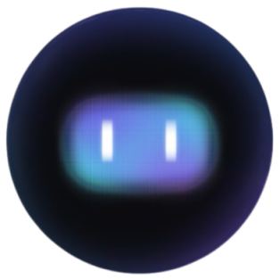

# EyeForBlind 👁️



## 👀 Overview 

**EyeForBlind** is a revolutionary mobile application developed to visual impaired individuals, helping them navigate safely and independently in complex urban environments.

**Key Features:**
- Critical Object Detection
    - Identifying pedestrians
    - Detecting traffic signals
    - Locating pedestrian crosswalks
- Traffic Signal Analysis
    - Interpreting traffic light states (green, red, yellow)
    - Recognizing pedestrian crossing signals
- Safety Behavior Prediction
    - Tracking pedestrian movements
    - Predicting movement intentions
    - Alerting potential collision risks
- User-Friendly Communication
    - Converting visual information to audio
    - Providing timely and clear warnings

## 🎥 Demo

<video src="./result/demo/video/demo.mp4"></video>

## 🚀 Quick Start

### Prerequisites

- Python 3.7.0
- PyTorch
- OpenCV
- CUDA (optional, for GPU acceleration)

### Setup Steps

1. **Clone the Repository**
   ```bash
   git clone https://github.com/HungDongne/Eye-for-blind.git
   cd Eye-for-blind
   ```

2. **Create Virtual Environment**
   ```bash
   python -m venv .venv
   .venv\Scripts\activate  # On Windows
   # source .venv/bin/activate  # On macOS/Linux
   ```

3. **Install Dependencies**
   ```bash
   pip install -r requirements.txt
   ```

4. **Download Trained Model**
   - Download the pre-trained YOLOR model from [Google Drive](https://drive.google.com/file/d/12vFn-AfXKjto2Etit-1bAUow5ZTvYmJP/view?usp=sharing)
   - Move `yolor_p6.pt` to the `yolormodel` folder

## 🖥️ Basic Usage

```bash
# Run with default settings
python superman.py

# Specify video and enable GPU
python superman.py --videoName demo2.mp4 --use_cuda 0
```

### Command Line Arguments

#### General Arguments

| Argument | Type | Default | Description |
|----------|------|---------|-------------|
| `--use_cuda` | int | 0 | Enable GPU processing (0: CPU, 1: GPU) |
| `--videoName` | str | 'demo2.mp4' | Input video file name |
| `--resize` | bool | False | Resize input video frames |
| `--size` | int | 1280 | Resize dimensions |
| `--video2frames` | bool | True | Convert video to individual frames |

#### Object Detection Arguments

| Argument | Type | Default | Description |
|----------|------|---------|-------------|
| `--device` | str | 'cpu' | Processing device (cpu or cuda) |
| `--weights` | str | 'yolormodel/yolor_p6.pt' | Path to pre-trained model weights |
| `--img-size` | int | 640 | Inference image size (pixels) |
| `--names` | str | 'yolormodel/data/coco.names' | Path to class names file |
| `--cfg` | str | 'yolormodel/yolor_p6.cfg' | Model configuration file path |
| `--conf-thres` | float | 0.25 | Object confidence threshold |
| `--iou-thres` | float | 0.5 | IoU threshold for Non-Maximum Suppression |
| `--classes` | int[] | None | Filter detection by specific class IDs |
| `--agnostic-nms` | flag | False | Enable class-agnostic Non-Maximum Suppression |
| `--augment` | flag | False | Enable augmented inference |

## 🌟 Features

- Real-time object detection
- Video frame extraction
- Supports both CPU and GPU processing
- Designed for assistive navigation

## 📞 Contact

- Dong Quang Duy Hung - [hungdqd1711@gmail.com](mailto:hungdqd1711@gmail.com)
- Le Quy Duong - [lequyduong1822@gmail.com](mailto:lequyduong1822@gmail.com)
- Vo Le Hieu - [huay1602@gmail.com](mailto:huay1602@gmail.com)
- Ha Truong Giang - [hatruonggiang222@gmail.com](mailto:hatruonggiang222@gmail.com)